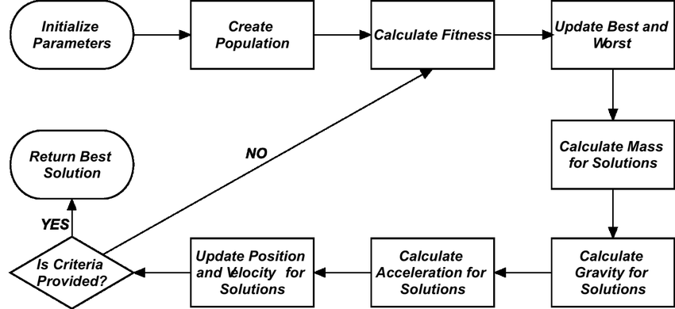
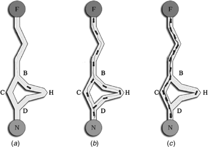

<!-- Main -->

<!-- Two -->
<section id="two" class="spotlights">
	<section>
		
		

			

				<header class="major">
					<h3>Music Genre Belief Recognition</h3>
				</header>
				
This was the major project for the course CS543: Massive Data Storage and Retrieval. The aim of the project was to be able to predict genre of a song with time sequencing. It was conceptualized and modelled with the help of spectrograms, convolutional neural networks and recurrent neural networks (later replaced by time-distributed layers to improve upon accuracy). Finally, the model was deployed and visualized on web by using TensorflowJS front-end development. <b>Tech used: Python, TensorflowJS, Keras, JavaScript, HTML, CSS</b> <a href="https://www.youtube.com/watch?v=2p-13hnVhA0"><b>Demo</b></a>

				<ul class="actions">
					<li><a href="https://github.com/vedantc6/CS543-MusicGenreRecognition" class="button">Learn more</a></li>
				</ul>
			

		

	</section>
	<section>
		
		

			

				<header class="major">
					<h3>Live Transcription of Sign Language using Convolutional Neural Networks</h3>
				</header>
				
This project was my Bachelor Thesis project and my introduction to the world of convolutional neural networks. The aim of the project was to deploy a webcam based user interface which could predict the sign language in real time. The core of the model is a CNN architecture, trained on a dataset of ~0.17 million images, achieving an accuracy of 97%. The github repo is kind of unstructured, which needs to be updated soon. <b>Tech used: Python, TensorflowJS, Keras, OpenCV</b>

				<ul class="actions">
					<li><a href="https://github.com/vedantc6/LiveSignLanguageCNNs" class="button">Learn more</a></li>
				</ul>
			

		

	</section>
	<section>
		
		

			

				<header class="major">
					<h3>Gravitational Search Algorithm in Recommendation Systems</h3>
				</header>
				
Project of many firsts. First Published paper - First International Conference - First Research experience. The motivation that stemmed the conceptualization of this paper was along the lines of fusing computational intelligence techniques with Collaborative filtering methods. It explored a relatively new bio-inspired meta-heuristic algorithm named Gravitational Search Algorithm(GSA) for the purpose of recommending jokes to users. Later, I presented the paper in the 8th International Conference on Swarm Intelligence, Fukuoka, Japan. 

				<ul class="actions">
					<li><a href="https://link.springer.com/chapter/10.1007/978-3-319-61833-3_63" class="button">Learn more</a></li>
				</ul>
			

		

	</section>
	<section>
		
		

			

				<header class="major">
					<h3>Tackling TSP with Ant Colony Optimization and Visualization</h3>
				</header>
				
Final project for CS512:Data Structures and Algorithms. The traveling salesman problem was tackled with the help of a nature inspired technique called ant colony Optimization. The project models the probabilistic behavior of pheromone chemical interactions between ants while foraging for food. A simple user interface was also created to allow the user to play with the number of ants and steps the program should be run for. The final output was a visualization of the order of cities to be traveled so as to cover the least distance possible.

				<ul class="actions">
					<li><a href="https://github.com/vedantc6/TSPACO" class="button">Learn more</a></li>
				</ul>
			

		

	</section>
	<section>
		
		

			

				<header class="major">
					<h3>Recommendation Systems</h3>
				</header>
				
Some of the basic and intermediate level work I did on recommendation systems before starting research work on <a href="https://link.springer.com/chapter/10.1007/978-3-319-61833-3_63">my paper</a> in my undergraduate days. Implementing song recommendation system based on popularity and items, movie recommendation system using Collaborative filtering with Particle Swarm Optimization (which later was a comparison algorithm for the paper)

				<ul class="actions">
					<li><a href="https://github.com/vedantc6/MusicRecommendation" class="button">Learn more</a></li>
				</ul>
			

		

	</section>
</section>

